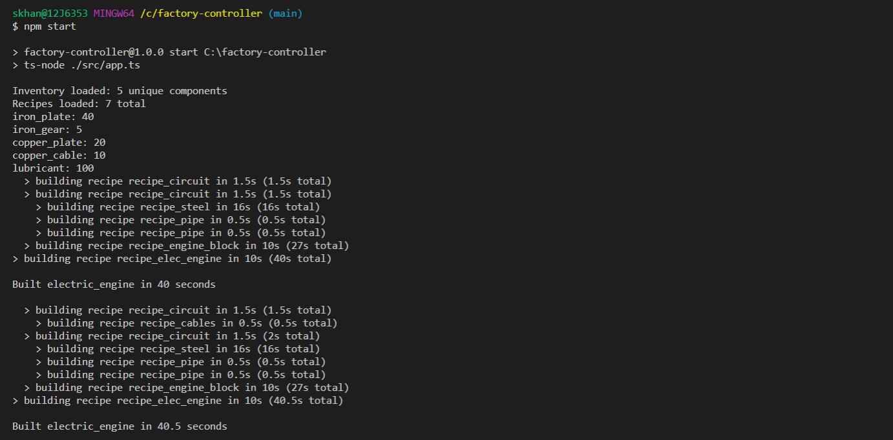

# factory-controller

You have a factory. It is a great factory that can build a number of things. It can take components from an
inventory and build a bigger component, returning the larger component to the inventory.
Your task is to build a system that will instruct the factory what sub-components to build first, in order to
complete a larger order.

You will be provided a starting inventory list and a “recipe” schema list, a recipe schema contains:

```
● A list of items required to build this recipe
● A list of items that are built as a result (it’s not always a single item)
● The time it takes to build this recipe
```

If your factory cannot build all required sub-components for a build order, it should not build any of the
sub-components, but instead fail that build task.

If, for example, you are asked to build an electronic circuit, this circuit first requires copper cables. Your
program will detect that you have no copper cables in the inventory and will first instruct the factory to build
the cables before attempting to build the electronic circuit.

Once the program is complete, give your factory these build orders (in order):

```
● 3x electric_engine
● 5x electric_circuit
● 3x electric_engine
```

The program should first build all required parts to complete each item, however it will also run out of
resources and will not be able to complete the final electric_engine.
● Some of the 5x electric circuits should be consumed by the final build order
● Only 4 of the 6 electric engines will be built - the 5th will fail due to a lack of iron plates (and
consume no resources)

You should also display the time it took to build each build order. This may vary, depending on the number
of sub-components it requires to be built.
Output the final state of the inventory once the program has completed.



The project uses the following technologies:

- Backend: NodeJs
- Type Checking: Typescript

## Getting Started

```bash
npm install
npm start
```

There are six methods in the FactoryController class:

```
- loadInventory   - Takes an argument of type IInventory and adds it to the inventory
- loadRecipes     - Takes a json object and stores it as IRecipes
- printInventory  - Prints the Inventory property
- printRecipes    - Prints the Recipes property
- build           - Recursively builds the given item
- buildMany       - Builds multiple items
```

## Scripts

```
- npm run eslint           - will run the linter checks
- npm test                 - will run all the tests
- npm run coverage         - will generate code coverage reports
- npm run build            - will generate generate .js from the .ts files for production use
- npm run build:watch      - will generate generate .js from the .ts files for production use and watch for changes
- npm start                - will run the app
```

## Project Structure

### Overall Structure

1. The `test` directory contains all the unit and integration tests.
2. The `src` directory contains the all the source code including the app.ts file.
3. The `dist` directory contains all compiled js files.

## Development

This project uses ESLint to detect suspicious code in JavaScript files.
Visit http://eslint.org for details.

### Testing

This project uses jest.
Visit https://jestjs.io/ for details.

To execute tests:

```bash
npm test
```

To calculate coverage:

```bash
npm run coverage
```

The coverage reports will be in the `coverage` folder

## FAQ

## Credits

Written by Shahriar Hasan Khan
Contact: shahriar27@hotmail.com
